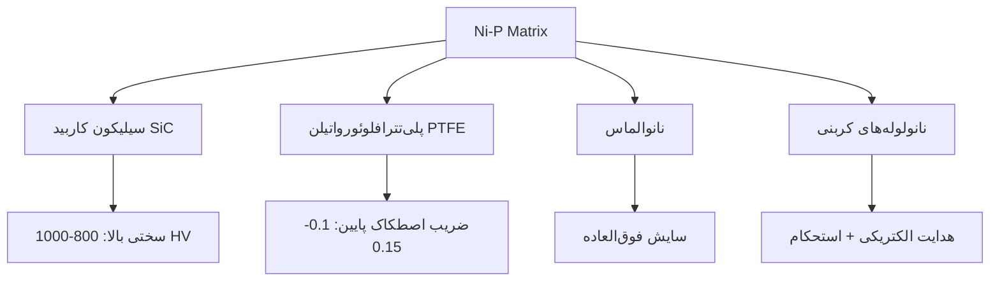

# 🛡️ عملیات‌های پوششی و سطحی روی آلومینیوم

## 📊 جدول مقایسه‌ای کلی

| پوشش/فرآیند | ضخامت معمول (μm) | رنگ/ظاهر | سختی (HV) | مقاومت خوردگی | هدایت الکتریکی | هزینه نسبی | کاربردهای اصلی |
|-------------|------------------|----------|-----------|----------------|----------------|------------|----------------|
| **هارد آنادایز (Type III)** | 25-75 | مات تا نیمه‌براق (خاکستری تیره) | 400-600 | **عالی** | بسیار پایین | متوسط-بالا | قطعات سایشی، هوافضا، نظامی |
| **آنادایز معمولی (Type II)** | 5-25 | براق تا مات (طیف رنگی) | 200-350 | خوب | پایین | پایین-متوسط | دکوراتیو، معماری، قطعات مصرفی |
| **سخت‌کاری PN (Plasma Nitriding)** | 5-50 | خاکستری مات فلزی | **800-1200** | خوب | حفظ می‌شود | بالا | قطعات با سایش شدید، صنعت نفت و گاز |
| **پوشش Ni-Cd کروماته** | 8-25 | زرد-طلایی مات | 200-400 | **عالی** (در برابر نمک) | متوسط | بالا | هوافضا، دریایی، قطعات نظامی |
| **کروماته (Alodine/Chromate)** | 0.5-1 | زرد-سبز روشن | - | خوب (و چسبندگی رنگ) | خوب | بسیار پایین | آماده‌سازی برای رنگ، قطعات الکترونیکی |

---

## 🔬 توضیحات تخصصی هر فرآیند

### ۱. **هارد آنادایز (Hard Anodizing - Type III)**
#### فرآیند:
- **الکترولیت:** اسید سولفوریک غلیظ (معمولاً ۱۵-۲۰٪) در دمای **پایین** (۰ تا ۱۰°C)
- **ولتاژ بالا:** ۴۰-۷۵ ولت
- **زمان طولانی:** ۳۰-۶۰ دقیقه (بسته به ضخامت)

#### ویژگی‌های کلیدی:
- **لایه اکسیدی بسیار سخت و ضخیم** (تا ۷۵ میکرون)
- **تخلخل کم** → چگالی بالا
- **قابلیت جذب رنگ‌های آلی** (مشکی رایج است)
- **عایق حرارتی و الکتریکی** خوب

#### کاربردها:
- یاتاقان‌های هیدرولیک
- پیستون‌های پنوماتیک
- قطعات ابزار دقیق
- تجهیزات نظامی و هوافضا

---

### ۲. **سخت‌کاری PN (Plasma Nitriding)**
#### فرآیند:
- انجام در **خلأ** با گازهای نیتروژن/هیدروژن
- ایجاد **پلاسما** با ولتاژ بالا (۵۰۰-۱۰۰۰ ولت)
- دمای ۳۵۰-۵۰۰°C برای ۴-۲۴ ساعت
- تشکیل لایه **نیترید آلومینیوم (AlN)** و نفوذ نیتروژن در زیرلایه

#### ویژگی‌های کلیدی:
- **سختی فوق‌العاده بالا** (تا ۱۲۰۰ HV)
- **حفظ خواص زیرلایه** (بدن تغییر شکل)
- **بهبود خستگی (Fatigue)**
- **سازگاری با بیشتر آلیاژهای Al** (حتی سری ۷xxx)

#### کاربردها:
- قطعات موتورهای احتراق داخلی
- ابزارهای قالب‌گیری تزریق پلاستیک
- شیرآلات صنعتی با سایش بالا
- اجزای توربین‌های گازی

---

### ۳. **پوشش نیکل-کادمیوم کروماته (Ni-Cd Chromate)**
#### فرآیند:
۱. **آماده‌سازی سطح:** چربی‌گیری، اچینگ
۲. **زینکیت (Zincate):** ایجاد لایه نازک روی برای چسبندگی
۳. **آبکاری نیکل:** ۵-۱۵μm (غالباً نیکل شیمیایی)
۴. **آبکاری کادمیوم:** ۸-۲۵μm
۵. **کروماته کردن:** ایجاد لایه زرد/طلایی (تبدیل کرومات)

#### ویژگی‌های کلیدی:
- **مقاومت استثنایی در آب دریا و محیط‌های کلریدی**
- **خودترمیم‌شوندگی (Sacrificial Protection)**
- **خاصیت روانکاری ذاتی** کادمیوم
- **کم‌خطرتر از کادمیوم خالص** (بسته شدن در کرومات)

#### کاربردها:
- **قطعات هواپیما** (مخصوصاً در نواحی اتصال)
- **تجهیزات دریایی و کشتی‌سازی**
- **قطعات نظامی** با نیاز به دوام بالا
- **تجهیزات ارتباطی دریایی**

---

### ۴. **کروماته‌ کردن (Chromate Conversion Coating)**
#### انواع:
- **Alodine** (نوع I): لایه نازک، سبز-طلایی، برای چسبندگی رنگ
- **Iridite** (نوع II): لایه ضخیم‌تر، زرد-قهوه‌ای، مقاومت خوردگی بهتر

#### ویژگی‌ها:
- **لایه بسیار نازک** (۰٫۱-۱μm)
- **هدایت الکتریکی حفظ می‌شود**
- **پایه عالی برای رنگ و چسب**
- **فرآیند سریع و ارزان**

---

## ⚠️ ملاحظات زیست‌محیطی و ایمنی

| فرآیند | مواد خطرناک | ملاحظات زیست‌محیطی | جایگزین‌های مدرن |
|---------|-------------|-------------------|------------------|
| **هارد آنادایز** | اسید سولفوریک، فلزات سنگین در رنگ | پساب اسیدی، نیاز به تصفیه | آنادایز بدون اسید (Phosphoric Acid) |
| **سخت‌کاری PN** | گاز آمونیاک (در برخی فرآیندها) | کم‌خطرتر از نیتریدینگ گازی | نیتروکربورایزینگ پلاسما |
| **Ni-Cd کروماته** | **کادمیوم (سمی)**، اسید کرومیک (کارسینوژن) | **بسیار خطرناک**، محدودیت‌های قانونی شدید | Zn-Ni، Cd-Free، پوشش‌های کامپوزیتی |
| **کروماته** | اسید کرومیک VI (کارسینوژن) | در حال حذف از صنعت (RoHS, REACH) | پوشش‌های بدون کروم (Trivalent Chrome) |

---

## 🎯 راهنمای انتخاب بر اساس نیاز

### اگر نیاز شما...
- **سایش شدید** است → **هارد آنادایز** یا **PN**
- **مقاومت خوردگی دریایی** است → **Ni-Cd کروماته** (با احتیاط) یا **آنادایز ضخیم**
- **هدایت الکتریکی** مهم است → **کروماته سبک** یا **پوشش‌های بدون کروم**
- **دمای بالا** دارید → **PN** (تا ۴۰۰°C مقاوم است)
- **بودجه محدود** دارید → **آنادایز معمولی** یا **کروماته**
- **ملاحظات زیست‌محیطی** دارید → **پوشش‌های بدون کادمیوم و کروم VI**

---

## 🔄 فرآیندهای نوین و جایگزین

### ۱. **پوشش‌های کامپوزیتی (Composite Coatings)**
- **Ni-P-SiC**: سختی بالا + مقاومت سایش
- **Ni-P-PTFE**: خاصیت ضداصطکاک (self-lubricating)

### ۲. **پلاسمای الکترولیتی (PEO/Micro Arc Oxidation)**
- لایه سرامیکی روی Al، Mg، Ti
- سختی تا ۲۰۰۰ HV
- مقاومت خوردگی و سایش عالی

### ۳. **پوشش‌های تبدیلی بدون کروم**
- **TCP** (Trivalent Chrome Process)
- **زرکونیم/تیتانیوم** بر پایه فلوراید
- **سیلان**‌های عملکردی (Functional Silanes)

### ۴. **پوشش‌های جایگزین کادمیوم**
- **Zn-Ni** (12-15% Ni)
- **Zn-Co**، **Zn-Fe**
- **آلومینیوم IVD** (Aluminum Vacuum Deposition)

---

## 📝 نکات مهم در طراحی برای پوشش‌دهی

1. **گوشه‌ها و لبه‌ها:**
   - شعاع حداقل ۰٫۸mm برای پوشش یکنواخت
   - از تیز بودن لبه‌ها پرهیز کنید

2. **سوراخ‌ها و حفره‌ها:**
   - نسبت عمق به قطر بهتر است بیشتر از ۲:۱ نباشد
   - برای آبکاری، سوراخ‌های اضافی برای خروج محلول در نظر بگیرید

3. **ضخامت پوشش در تلرانس‌ها:**
   - پوشش روی تمام سطوح تشکیل می‌شود → روی ابعاد تأثیر می‌گذارد
   - برای اتصالات interference fit، پوشش را در محاسبات لحاظ کنید

4. **آلیاژ مناسب:**
   - سری ۵xxx و ۶xxx برای آنادایز بهترین هستند
   - سری ۲xxx (مس بالا) و ۷xxx (روی بالا) ممکن است نیاز به فرآیند خاص داشته باشند

این پوشش‌ها هرکدام دنیای پیچیده‌ای دارند و انتخاب نهایی باید با در نظر گرفتن **نیازهای عملکردی، هزینه، ملاحظات زیست‌محیطی و قابلیت تولید** انجام شود.


# 🛡️ توسعه و تشریح جامع عملیات‌های پوششی آلومینیوم

## 📊 ماتریس کامل خواص ایجاد شده توسط هر فرآیند

### **هارد آنادایز (Type III)**
| خاصیت ایجاد شده | مکانیزم | مقدار/کیفیت | محدودیت‌ها |
|----------------|----------|-------------|------------|
| **سختی سطح** | تشکیل Al₂O₃ آلفا کریستالی | 400-600 HV (معادل 50-60 HRC) | شکننده در ضربه‌های شدید |
| **مقاومت سایش** | لایه سخت با تخلخل کم | ۵-۱۰ برابر آلومینیوم خام | در بارهای نوسانی ممکن است ترک بخورد |
| **مقاومت خوردگی** | لایه اکسیدی متراکم و غیرفعال | 1000+ ساعت نمک‌پاش بدون خوردگی | در pH شدیداً اسیدی/بازی آسیب می‌بیند |
| **عایق الکتریکی** | اکسید آلومینیوم عایق است | مقاومت سطحی: ۱۰⁹-۱۰¹² Ω/cm² | برای اتصالات الکتریکی نامناسب |
| **عایق حرارتی** | هدایت حرارتی پایین اکسید | ۱-۲ W/m·K (نسبت به Al: ۲۴۰) | مشکل در دفع حرارت |
| **چسبندگی رنگ** | ساختار متخلخل سطحی | پیوند مکانیکی عالی | نیاز به آب‌بندی (Sealing) |
| **ضخامت** | کنترل با زمان و ولتاژ | ۲۵-۷۵ μm | روی تلرانس ابعادی اثر می‌گذارد |

**نکته حیاتی:** هارد آنادایز **تنش‌های پسماند فشاری** ایجاد می‌کند که مقاومت به خستگی را **افزایش** می‌دهد.

---

### **سخت‌کاری PN (Plasma Nitriding)**
| خاصیت ایجاد شده | مکانیزم | مقدار/کیفیت | محدودیت‌ها |
|----------------|----------|-------------|------------|
| **سختی فوق‌العاده** | تشکیل AlN و نفوذ نیتروژن | ۸۰۰-۱۲۰۰ HV (معادل ۶۵-۷۰ HRC) | فقط در دمای پایین مؤثر است |
| **مقاومت به سایش** | لایه سخت و چقرمه | ۱۵-۲۰ برابر آلومینیوم خام | هزینه بالا |
| **مقاومت خستگی** | تنش‌های فشاری سطحی | بهبود ۵۰-۱۰۰٪ در عمر خستگی | نیاز به خلأ بالا |
| **پایداری حرارتی** | پایداری AlN تا دمای بالا | مقاوم تا ۴۵۰-۵۰۰°C | بالای ۵۵۰°C تجزیه می‌شود |
| **هدایت حرارتی** | حفظ زیرلایه آلومینیومی | ۱۲۰-۱۸۰ W/m·K (هنوز خوب) | کاهش جزئی نسبت به Al خالص |
| **هدایت الکتریکی** | حفظ نسبی | ۲۰-۳۰٪ کاهش | هنوز برای بسیاری کاربردها کافی |
| **مقاومت خوردگی** | AlN نسبتاً خنثی است | متوسط (بهبود جزئی) | نیاز به پوشش مکمل |

**ویژگی منحصر به فرد:** PN **سختی را بدون تغییر ابعاد** ایجاد می‌کند (برخلاف آنادایز).

---

### **پوشش Ni-Cd کروماته**
| خاصیت ایجاد شده | مکانیزم | مقدار/کیفیت | محدودیت‌ها |
|----------------|----------|-------------|------------|
| **حفاظت کاتدی** | کادمیوم آند نسبت به Al | پتانسیل استاندارد: -0.40V (ایده‌آل) | تخریب در محیط‌های اکسیدکننده قوی |
| **مقاومت دریایی** | کرومات لایه محافظ | ۵۰۰۰+ ساعت نمک‌پاش | ممنوعیت کادمیوم در بسیاری کشورها |
| **روانکاری ذاتی** | ساختار کریستالی Cd | ضریب اصطکاک: ۰.۲-۰.۳ | محدود دمایی (تا ۲۵۰°C) |
| **قابلیت لحیم‌کاری** | سطح فلزی فعال | لحیم‌کاری عالی بدون فلاکس | فقط با لحیم‌های نرم |
| **مقاومت سایش** | Cd نسبتاً نرم است | متوسط (بهبود جزئی) | برای سایش شدید مناسب نیست |
| **مقاومت به خزش** | خاصیت Cd در دماهای متوسط | خوب تا ۲۰۰°C | |
| **خودترمیم‌شوندگی** | مهاجرت کرومات به خراش | ترمیم خراش‌های سطحی | فقط برای خراش‌های کوچک |

**مکانیزم حفاظت:** ۱) سد فیزیکی ۲) مهار خوردگی توسط کرومات ۳) حفاظت کاتدی

---

### **کروماته (Conversion Coating)**
| خاصیت ایجاد شده | مکانیزم | مقدار/کیفیت | محدودیت‌ها |
|----------------|----------|-------------|------------|
| **چسبندگی رنگ** | پیوند شیمیایی با سطح | بهبود ۱۰۰-۲۰۰٪ چسبندگی | ضخامت بسیار کم |
| **مقاومت خوردگی** | لایه کرومات غیرفعال | ۷۲-۱۶۸ ساعت نمک‌پاش | فقط برای محیط‌های ملایم |
| **هدایت الکتریکی** | لایه بسیار نازک | مقاومت < ۱۰ mΩ/cm² | مناسب برای اتصالات الکتریکی |
| **پایگاه برای چسب** | سطح فعال شیمیایی | قدرت پیوند چسب افزایش می‌یابد | |
| **قابلیت رنگ‌پذیری** | جذب رنگ در تخلخل‌ها | یکنواختی رنگ عالی | |
| **سرعت فرآیند** | واکنش شیمیایی سریع | ۳۰ ثانیه تا ۵ دقیقه | کنترل دقیق زمان لازم است |

---

## 🔬 پوشش‌های نوین و تکنولوژی‌های پیشرفته

### **۱. پلاسمای الکترولیتی (PEO) / اکسیداسیون میکروآرک**
| خاصیت | توضیح | مزایا نسبت به آنادایز |
|-------|--------|---------------------|
| **سختی** | ۱۰۰۰-۲۰۰۰ HV (سرامیک Al₂O₃) | ۲-۴ برابر سخت‌تر |
| **ضخامت** | تا ۲۰۰ μm قابل دستیابی | ضخیم‌تر با چسبندگی بهتر |
| **دمای کاری** | مقاوم تا ۲۰۰۰°C | مقاومت حرارتی فوق‌العاده |
| **عایق الکتریکی** | مقاومت دی‌الکتریک بالا | برای کاربردهای HV مناسب‌تر |
| **چقرمگی** | ساختار Gradient (تدریجی) | کاهش شکنندگی |
| **کامپوزیتی** | امکان افزودن نانوذرات (SiC, Al₂O₃) | خواص سفارشی‌سازی |

**کاربردها:** موتورهای با دمای بالا، محفظه‌های الکترونیکی قدرت، ایمپلنت‌های پزشکی

### **۲. پوشش‌های نانوکامپوزیتی Ni-P-X**


**ویژگی‌ها:**
- **Ni-P-SiC:** مقاومت سایش در شرایط خشک و روغن
- **Ni-P-PTFE:** خودروان‌کاری (self-lubricating) برای کاربردهای بدون روان‌ساز
- **Ni-P-نانوالماس:** برای سایش بسیار شدید (ابزارهای برش)

### **۳. پوشش‌های مولتی‌لایر (چندلایه)**
**ساختار:** [Al زیرلایه] → [لایه میانی] → [لایه بیرونی]

| ترکیب لایه‌ها | عملکرد | کاربرد |
|--------------|---------|--------|
| **Ni/Cr/Ni** | حفاظت کاتدی + سد فیزیکی | قطعات خودرو در معرض نمک جاده |
| **TiN/TiAlN** | سایش + اکسیداسیون | ابزارهای برش آلومینیوم |
| **DLC/Ti** | اصطکاک پایین + سایش | قطعات متحرک در خلأ |

**مزیت:** ترکیب خواص مختلف در یک پوشش

### **۴. پوشش‌های تبدیلی بدون کروم (Cr-Free)**
| نوع | شیمی پایه | عملکرد | مقایسه با کرومات |
|-----|-----------|---------|-------------------|
| **TCP** (Trivalent Chrome) | Cr³⁺ + فلوراید | مقاومت خوردگی خوب | ۸۰-۹۰٪ کارایی کرومات |
| **زرکونیوم** | ZrO₂ + فلوراید | چسبندگی رنگ عالی | بدون محدودیت‌های قانونی |
| **سرامیک نانو** | SiO₂ + TiO₂ نانو | مقاومت سایش + خوردگی | شفاف، برای دکوراتیو |
| **سیلان‌ها** | ارگانو-سیلکون | چسبندگی چندمنظوره | سازگار با پلیمرها |

---

## 🎯 راهنمای انتخاب پیشرفته

### **شرایط: سایش خشک + خوردگی ملایم**
```python
if load_cyclic:
    coating = "هارد آنادایز + آب‌بندی Teflon"
elif temperature > 300:
    coating = "PN با لایه نازک"
else:
    coating = "PEO با ضخامت متوسط"
```

### **شرایط: محیط دریایی شدید + محدودیت وزن**
```python
if environmental_compliance == "strict":
    coating = "آلومینیوم IVD + پوشش تبدیلی Zr"
    # آلومینیوم رسوب داده شده در خلأ + زرکونیوم
elif budget_allowed:
    coating = "Ni-Cd کروماته (با مجوز)"
else:
    coating = "آنادایز ضخیم + آب‌بندی دوبل"
```

### **شرایط: هدایت الکتریکی + خوردگی اتمسفری**
```python
if conductivity_required > 50:  # % IACS
    coating = "کروماته نوع III (Iridite 14-2)"
elif corrosion_resistance > 500:  # ساعت نمک‌پاش
    coating = "پوشش Ni-P الکترولس + پسیواسیون"
else:
    coating = "پوشش تبدیلی Zr"
```

---

## 📈 روندهای آینده در پوشش آلومینیوم

### **۱. پوشش‌های هوشمند (Smart Coatings)**
- **خودترمیم‌شونده:** کپسول‌های ریز حاوی مهارکننده خوردگی
- **فوتوکاتالیست:** پوشش‌های TiO₂ که با UV آلودگی‌ها را تجزیه می‌کنند
- **تغییر رنگ با خوردگی:** شناسایی زودهنگام خوردگی

### **۲. پوشش‌های چندمنظوره (Multifunctional)**
- **ضدخوردگی + ضدباکتری:** برای صنایع غذایی و پزشکی
- **هدایت الکتریکی + حفاظت:** برای الکترونیک
- **سبک‌وزنی + استحکام:** کامپوزیت‌های آلومینیوم-پلیمر

### **۳. پوشش‌های پایدار (Sustainable Coatings)**
- **فرآیندهای بدون آب (Dry Processes):** رسوب فیزیکی بخار (PVD)
- **مواد بازیافتی:** پوشش‌های برپایه بیوپلیمرها
- **انرژی تجدیدپذیر:** استفاده از انرژی خورشیدی در فرآیندها

---

## ⚠️ نکات طراحی حیاتی

### **۱. اثر پوشش بر خواص مکانیکی**
```
آلومینیوم 7075-T6:
استحکام خستگی (۱۰⁷ سیکل):
- بدون پوشش: ۱۶۰ MPa
- با آنادایز: ۱۳۰ MPa (کاهش ۱۹٪)
- با PN: ۱۸۰ MPa (افزایش ۱۲.۵٪)
```

### **۲. کنترل ابعادی پس از پوشش**
```
فرمول تخمینی افزایش ابعاد:
ΔD ≈ ۲ × ضخامت پوشش × ضریب پوشش

ضرایب پوشش:
- آنادایز: ۰.۵ (نیمی به داخل، نیمی به خارج)
- آبکاری: ۱.۰ (همه به خارج)
- PVD: ۱.۰ (همه به خارج)
```

### **۳. انتخاب آلیاژ برای پوشش**
| آلیاژ | مناسب برای | مشکلات احتمالی |
|-------|------------|----------------|
| **6061** | تمام پوشش‌ها | بهترین انتخاب عمومی |
| **7075** | PN, PEO | آنادایز ممکن است باعث ترک شود |
| **2024** | کروماته | آنادایز تیره و غیریکنواخت |
| **5052** | آنادایز رنگی | - |
| **Cast Al** | پوشش‌های تبدیلی | تخلخل ممکن است باعث مشکل شود |

---

## 🎓 خلاصه نهایی

هر پوشش یک **تراداف (Trade-off)** است:
- **هارد آنادایز:** سختی + خوردگی، اما شکننده + عایق
- **PN:** سختی فوق‌العاده + حفظ خواص، اما هزینه بالا
- **Ni-Cd:** حفاظت دریایی + روانکاری، اما سمیت + ممنوعیت
- **کروماته:** چسبندگی + هدایت، اما حفاظت محدود

**توصیه نهایی:** همیشه:
۱. تست نمونه اولیه در شرایط واقعی
۲. مشورت با تأمین‌کننده پوشش
۳. در نظر گرفتن کل هزینه چرخه عمر (نه فقط هزینه اولیه)

انتخاب پوشش امروزه یک **علم مهندسی چندرشته‌ای** است که نیازمند آگاهی از متالورژی، شیمی، محیط زیست و اقتصاد است.


