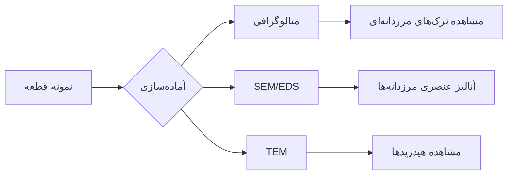
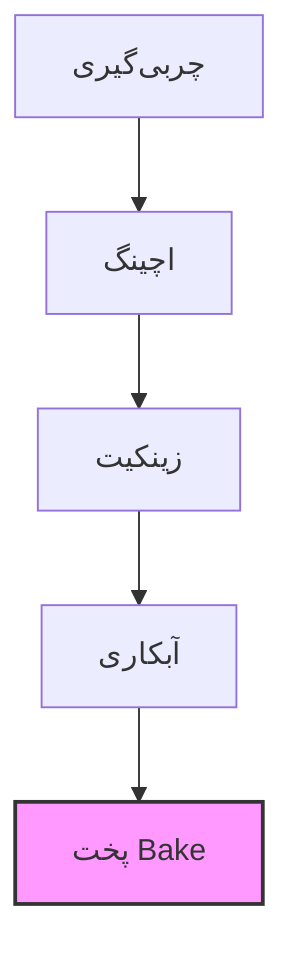

# 🔬 حذف تردی هیدروژنی (Hydrogen Embrittlement Removal) در آلومینیوم

## 📖 **تعریف و مفهوم پایه**

**تردی هیدروژنی (Hydrogen Embrittlement):** یک پدیده مخرب متالورژیکی که در آن **اتم‌های هیدروژن** در فلز نفوذ کرده و باعث:
- کاهش چقرمگی (Toughness)
- کاهش ازدیاد طول (Ductility)
- کاهش استحکام خستگی (Fatigue Strength)
- شکست ناگهانی و ترد (Brittle Fracture) تحت بارهای استاتیکی یا دینامیکی

---

## ⚠️ **چرا آلومینیوم مستعد تردی هیدروژنی است؟**

### **منابع ورود هیدروژن به آلومینیوم:**
1. **فرآیندهای تولید:**
   - ذوب و ریخته‌گری (رطوبت در مواد شارژ)
   - جوشکاری (رطوبت در الکترود یا پوشش فلاکس)
   - آبکاری (آبکاری Ni، Cd، Zn)

2. **سرویس کاری:**
   - محیط‌های خورنده (اسیدی، بازی)
   - خوردگی گالوانیکی
   - تماس با سیالات حاوی هیدروژن

3. **فرآیندهای سطحی:**
   - چربی‌گیری قلیایی
   - اچینگ اسیدی
   - پولیش شیمیایی

---

## 🔬 **مکانیزم تردی هیدژونی در آلومینیوم**

### **سه مکانیزم اصلی:**

| مکانیزم | توضیح | بیشتر در چه آلیاژهایی |
|---------|-------|------------------------|
| **۱. فشار گازی (Blistering)** | تشکیل H₂ در تخلخل‌ها/رگه‌ها → فشار داخلی | آلیاژهای ریختگی با تخلخل |
| **۲. کاهش پیوند فلزی (HEDE)** | هیدروژن پیوند اتمی Al-Al را تضعیف می‌کند | آلیاژهای عملیات حرارتی شده |
| **۳. تشکیل هیدرید (Hydride)** | تشکیل AlH₃ در مرزدانه‌ها (نادر در Al) | - |

### **مناطق حساس در ریزساختار:**
```
مرزدانه‌ها (Grain Boundaries) ← بیشترین حساسیت
نقاط سه‌گانه (Triple Points)
مرز فازها (Phase Boundaries)
نابجایی‌ها (Dislocations)
```

---

## 🛠️ **روش‌های حذف/کاهش تردی هیدروژنی**

### **۱. عملیات حرارتی پخت (Baking Heat Treatment)**
**متداول‌ترین روش صنعتی**

| پارامتر | محدوده معمول | مکانیزم |
|---------|--------------|----------|
| **دما** | ۱۵۰-۲۵۰°C | افزایش تحرک اتم‌های H |
| **زمان** | ۱-۲۴ ساعت | انتشار هیدروژن به سطح |
| **اتمسفر** | هوا یا خلأ | جلوگیری از اکسیداسیون |

**فرمول تخمینی زمان پخت:**
```
زمان (ساعت) = ضخامت قطعه (mm) × ضریب × (غلظت H اولیه)
```
- برای قطعات آبکاری شده: معمولاً ۴-۸ ساعت در ۲۰۰°C

### **۲. پخت در خلأ (Vacuum Baking)**
**موثرترین روش برای قطعات حساس**

| مزایا | معایب |
|-------|-------|
| سرعت انتشار بالاتر | هزینه تجهیزات بالا |
| جلوگیری از اکسیداسیون | محدودیت ابعاد محفظه |
| حذف کامل تا ۹۵٪ H | زمان بارگیری/تخلیه |

**شرایط معمول:**
- دما: ۲۰۰-۳۰۰°C
- فشار: ۱۰⁻³ تا ۱۰⁻۶ تور
- زمان: ۲-۱۲ ساعت (بسته به ضخامت)

### **۳. عملیات حرارتی T7x برای آلیاژهای Al**
**مخصوص آلیاژهای سری ۷xxx (Al-Zn-Mg-Cu)**

| عملیات | هدف | شرایط |
|--------|-----|-------|
| **T73** | مقاومت به SCC + کاهش HE | پیرسازی دو مرحله‌ای |
| **T76** | مقاومت به اکسفولیاسیون | - |
| **T74** | بهینه‌سازی استحکام و چقرمگی | - |

**مکانیزم:** کنترل رسوب فاز η (MgZn₂) در مرزدانه‌ها

### **۴. روش‌های غیرحرارتی**

| روش | توضیح | کاربرد |
|-----|-------|--------|
| **التراسونیک** | امواج فراصوت ایجاد نابجایی → انتشار H | قطعات نازک، ورق‌ها |
| **کرنش‌دهی پلاستیک** | کارسرد ملایم → تله‌های H | قبل از آبکاری |
| **پوشش‌های مانع** | Ni، Cu، Cr → جلوگیری از نفوذ H | قطعات در معرض خوردگی |

---

## 📊 **روش‌های تشخیص و اندازه‌گیری**

### **۱. تست‌های مخرب:**

| تست | استاندارد | خروجی |
|-----|-----------|--------|
| **تاخیر در شکست (SSRT)** | ASTM G129 | زمان تا شکست تحت H |
| **بارگذاری مرحله‌ای (STEP)** | - | تعیین آستانه HE |
| **خمش سه‌نقطه‌ای** | ASTM E290 | تغییر در رفتار ترد-نرم |

### **۲. تست‌های غیرمخرب:**

| روش | حساسیت | عمق نفوذ |
|-----|---------|-----------|
| **TDA (Thermal Desorption Analysis)** | 0.1 ppm | کل ضخامت |
| **جذب/تولید گاز** | 0.01 ml/100g | سطحی |
| **اولتراسونیک (UT)** | تغییرات ماکرو | بسته به فرکانس |

### **۳. روش‌های متالورژیکی:**



---

## 🏭 **راهکارهای صنعتی و پیشگیرانه**

### **برای ریخته‌گری:**
1. **خشک کردن مواد شارژ:** رطوبت < 0.02%
2. **استفاده از گازهای خشک:** N₂ یا Ar برای عملیات
3. **عملیات حرارتی Homogenization:** ۴۵۰-۵۰۰°C برای ۴-۱۲ ساعت

### **برای جوشکاری:**
1. **خشک کردن الکترود/سیم جوش:** ۲۵۰-۳۰۰°C برای ۱-۲ ساعت
2. **کنترل رطوبت محیط:** RH < 40%
3. **پس‌گرمایش (Preheat):** ۱۰۰-۱۵۰°C برای قطعات ضخیم

### **برای آبکاری:**


**دستورالعمل عملی برای آبکاری:**
```
پخت (Baking) باید حداکثر ۴ ساعت پس از آبکاری انجام شود
دما: ۱۹۰-۲۲۰°C
زمان: ۳-۸ ساعت (بسته به ضخامت پوشش)
```

---

## 📈 **استانداردها و دستورالعمل‌ها**

| استاندارد | موضوع | محدوده |
|-----------|-------|--------|
| **AMS 2769** | عملیات حرارتی برای حذف هیدروژن | هوافضا |
| **ASTM B850** | راهنمای آبکاری روی Al | صنعتی |
| **MIL-STD-870** | عملیات پخت برای قطعات آبکاری شده | نظامی |
| **ISO 9587** | آماده‌سازی سطح برای آبکاری | بین‌المللی |

---

## ⚠️ **آلیاژهای با حساسیت بالا به HE**

| آلیاژ | حساسیت | دلیل |
|-------|---------|------|
| **۷۰۷۵-T6** | بسیار بالا | Zn/Mg بالا + ساختار حساس |
| **۲۰۲۴-T3** | بالا | Cu بالا + فازهای مرزدانه‌ای |
| **۶۰۶۱-T6** | متوسط | Mg/Si متوسط |
| **۵۰۸۳-H321** | پایین | Mg بالا ولی ساختار همگن |
| **۱۱۰۰** | بسیار پایین | آلومینیوم تجاری خالص |

---

## 🎯 **چک‌لیست کنترل کیفیت**

### **قبل از تولید:**
- [ ] آنالیز رطوبت مواد اولیه
- [ ] کالیبراسیون کوره‌های خشک‌کن
- [ ] بازرسی الکترود/سیم جوش

### **حین تولید:**
- [ ] کنترل رطوبت محیط کار
- [ ] مانیتورینگ دمای پیش‌گرم
- [ ] ثبت پارامترهای جوش/آبکاری

### **پس از تولید:**
- [ ] پخت به موقع (حتی‌الامکان < 4 ساعت)
- [ ] کنترل دمای پخت (ترموکوپل مستقل)
- [ ] تست نمونه‌ای (ترجیحاً SSRT)

---

## 🔬 **مطالعه موردی: قطعه هواپیما از جنس ۷۰۷۵-T6**

### **مشکل:**
شکست ترد در پیچ‌های آبکاری شده پس از ۲۰۰ ساعت پرواز

### **علت:**
هیدروژن جذب شده در فرآیند:
1. چربی‌گیری قلیایی
2. آبکاری نیکل
3. عدم پخت کافی

### **راه حل:**
1. تغییر فرآیند به چربی‌گیری امولسیونی (کم‌قلیا)
2. اضافه کردن پخت واسطه بعد از زینکیت
3. پخت نهایی: ۲۱۵°C به مدت ۱۰ ساعت

### **نتیجه:**
افزایش عمر خستگی از ۲۰۰ به ۲۰۰۰ ساعت

---

## 💡 **نکات کلیدی برای مهندسان:**

1. **زمان بحرانی:** حداکثر ۴ ساعت بین آبکاری و پخت
2. **دما بهینه:** ۲۰۰-۲۲۰°C برای بیشتر آلیاژهای Al
3. **ضخامت اثرگذار:** پخت فقط برای قطعات تا ضخامت ۱۰mm مؤثر است
4. **آلیاژهای ریختگی:** نیاز به پخت طولانی‌تر (۱۲-۲۴ ساعت)
5. **تست‌های اعتبارسنجی:** حداقل سالی یکبار تست SSRT روی نمونه‌ها

**جمله طلایی:** "تردی هیدروژنی مانند بمب ساعتی در فلز است - ممکن است امروز نشود، اما فردا حتماً می‌ترکد!"